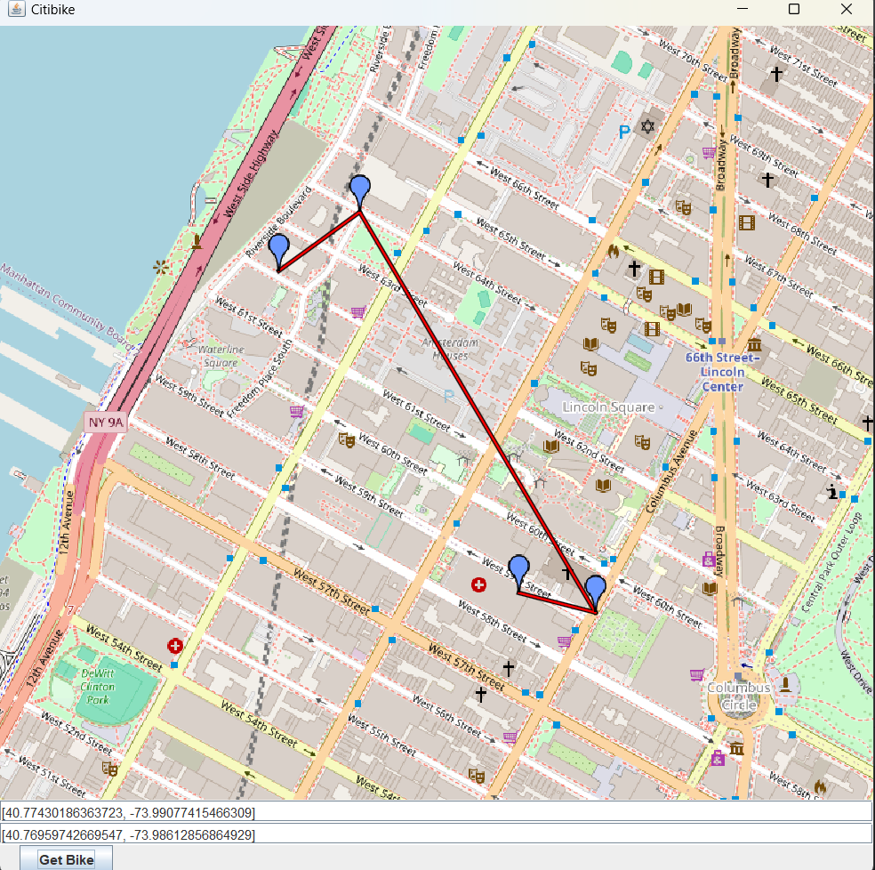

# CitiBike 

This program allows users to input a starting and ending location. Using data from CitiBike's JSON feed, the program calculates and displays the nearest CitiBike station with available bikes to the starting point, and the closest station with available docks to the destination. This helps users plan their trip more efficiently by showing optimal bike-sharing locations based on their journey.

